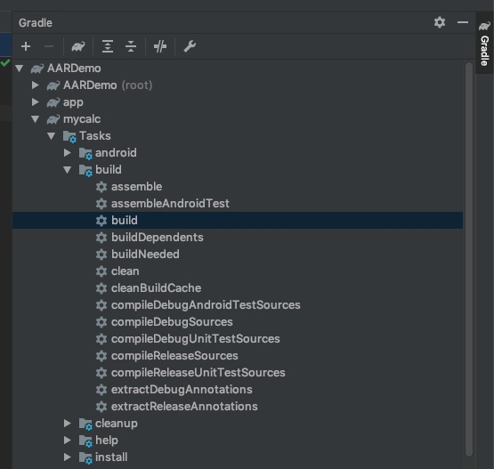
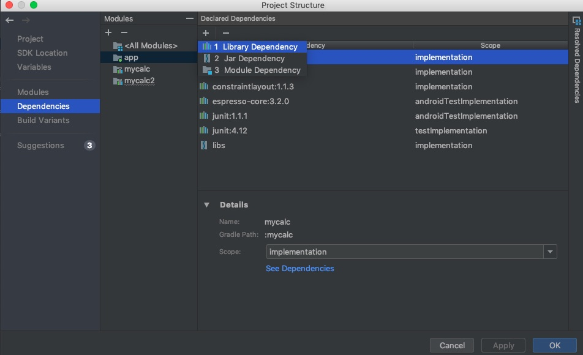

# Build aar file demo

## Create
File > New > New Module > Android Library > Create

## Coding
Write your program

## Build
IDE > Right side > Target module > Tasks > build > build > Double click

## Output
Target module dir/build/outputs/arr/xxx.aar

## Use/Import
1. File > New > Import Module
2. File > Project Structure > Dependencies > app > Add > Module Dependency > Select your module > OK

